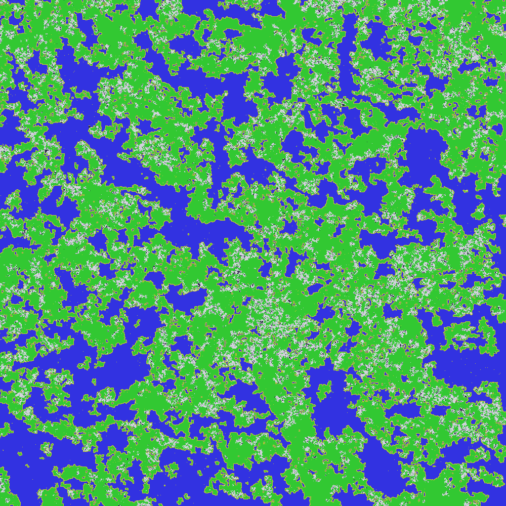

 Morkov Maptiler 
=================

### NOTE: this is a *SINGLE-THREADED* variant of the [morkovmap](https://crates.io/crates/morkovmap) crate.

This is a non-threadsafe variant that may or may not be 
faster than the threadsafe one (although on smaller maps, it 
definitely is at least 10% faster)

How fast? 

***30x30 at 30*** - a 900-tile map at 30 FPS 
with a bunch of time to spare, with rendering included.

This crate will track the main `morkovmap`'s semver major 
and minor versions, but *may diverge on patch versions*.

## Data-driven procedural map generation

### Landmasses:
 

### Derelict space stations:

 

### ...and more!

# Usage:

Morkov Maptiler is available both as an app and as a Rust library.

### **App:** 

**PRE-BUILT**: 

Simply run the executable (`morkovmap.exe` on Windows)


**FROM SOURCE**: 

You will need a Rust compiler installed. 

1) Download and install a Rust compiler (if you don't have one)
2) Download the source code of this project
3) Open your terminal in the root directory of the project (you should 
be able to see this README and a `src/` at minimum.
4) In your terminal, run `cargo run -r `.
5) You should now see the code compiling and running.

**In both cases**, you should now see a new file, `map.png`, 
getting created in the same directory as the executable.


Configuration
-------------

The map generator rules can be edited in a file called `rules.json` 
in the working directory from which you run the app.

If you do not see this file, it will be autogenerated for you
after the first run with a default preset.

Alternatively, you could copy and edit one of the ruleset files 
in the `examples/` directory and save it as `rules.json`.

As of right now, the config contains three main sections: 
1) **Layout rules**
2) **Coloring rules**
3) **Map size**


### Layout Rules
Layout rules are a map of relative weights; for instance:

```json
{
    "1": {"1": 1.0, "2": 3.0}, 
    "2": {"1": 3.0, "2": 1.0}
}
```

Indicates that the tile type 1 is thrice as likely to 
transition to a neighbor of type 2 than to another type 1.

Likewise, a tile of type 2 is thrice as likely to 
transition to a neighbor of type 1 than to a fellow 2.

This type of rule is likely to provide a slight 'banding' effect 
with 1s and 2s roughly interlaced with each other. 

### Coloring Rules

Is that a bit too abstract for you? 

Well, that's because the types don't represent anything 
just yet, and this is where the Coloring Rules come in.

These are a mapping of the types (same as in Layout) to 
RGB colors for visualization.

For example,

```json
"1": {
  "Rgb": [
    10,
    255,
    10
  ]
},
"2": {
  "Rgb": [
    10,
    10,
    255
  ]
}
```

Indicates that type 1 tiles are green (e.g. grass) 
and type 2 tiles are blue (e.g. water).

Note that this visualization convention does not have 
any 'meaning' attached; we could easily flip the color 
scheme and the layout would remain the same.

Currently, the only visualization engine colors each 
tile with a full pixel - in the future, this will be 
extended.

For that matter, a single map pixel does not need to 
correspond to a single 'physical' tile! 

You can use this as a library to generate 'biomes' and 
expand each generated tile into hundreds or thousands 
of sub-tiles across! 

How you fill the biome then is up to you - you could 
even use the library recursively, populating biomes 
with tiles using a different ruleset for each biome.

### Map Size

This should be fairly self-explanatory. Size of the map, 
as defined by the edge length (it's a square).

For example, `100` results in a 100x100 px map.

Keep in mind that the processing time scales with the 
number of tiles (linearly) and the number of tiles grows
with the map size (quadratically for 2D maps), so if you
increase the map size from 100px to 200px, you should 
expect that it will take 4x slower to complete.

Having said that, the current, under-optimized 
generator can easily handle up to a million tiles 
(1000x1000) per run using <700 MB RAM. 

Things start to get hairy beyond that point, and 
trying to generate such huge maps in one go is 
fundamentally inefficient - we are storing map data 
that is no longer relevant for our purposes.

This doesn't mean it's impossible - but a better 
approach is to generate smaller maps and stitch their 
edges together, which is something this algorithm is 
***REALLY*** good at.
